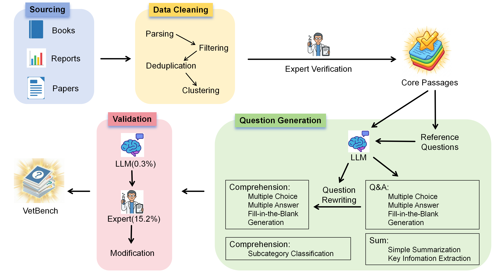

<div align="center">

<h1>VetBench: A Comprehensive Benchmark for Veterinary Large Language Models</h1>



[](https://arxiv.org/abs/placeholder)
[](LICENSE-DATA)

</div>

## 📖 Introduction
...

**VetBench** is the first comprehensive, multi-task benchmark designed to evaluate Large Language Models (LLMs) within the **"One Health"** framework of veterinary medicine.

While LLMs show transformative potential in healthcare, their application in veterinary medicine is hindered by a lack of rigorous evaluation standards. VetBench addresses this gap by covering **3 core pillars** (Basic, Preventive, and Clinical Veterinary Medicine) across **10 sub-disciplines**.

### Key Features
* **Full-Spectrum Coverage:** 3,036 high-quality questions derived from 276 expert-curated core passages.
* **Hybrid Construction Pipeline:** Combines automated generation with rigorous expert validation (Human-in-the-loop).
* **Multi-Task Evaluation:** Includes 11 distinct task types ranging from basic knowledge retrieval (QA) to complex clinical reasoning (Case Analysis).
* **Rigorous Metrics:** Utilizes a "Meta-Evaluation" validated Judge Model (GPT-5.2) and specific metrics (Accuracy, Macro-F1, BERTScore) for different task paradigms.


## 📂 Repository Structure

This repository contains the dataset, prompt templates, and evaluation scripts used in the VetBench paper.

```text
.
├── text/
│   ├── core_passages.json       # 276 High-quality veterinary text segments 
├── problem_bank/                # 3,036 Generated questions divided by task type 
│   ├── QA1_multi_choice.json
│   ├── QA2_multi_answer.json
│   ├── ...
│   └── RC5_classify.json
├── few_shot                     # Expert-verified k-shot examples
│   ├── 1_multi_choice.json
│   ├── 2_multi_answer.json
│   ├── ...
│   └── 7_classify.json
├── prompts/                     # Optimized System & User Prompts (JSON format)
│   ├── 1_multi_choice.json
│   ├── 2_multi_answer.json
│   ├── ...
│   └── 7_classify.json
└── README.md

## 📊 Dataset & Taxonomy

VetBench is structured into three primary categories and further divided into 10 sub-disciplines:

| Category | Sub-disciplines |
|----------|-----------------|
| Basic Vet Med | Anatomy & Histology, Physiology & Biochemistry, Pathology, Pharmacology |
| Preventive Vet Med | Microbiology & Immunology, Parasitology, Public Health |
| Clinical Vet Med | Internal Medicine, Surgery, Obstetrics & Andrology |

The benchmark includes 11 Task Types designed to probe different cognitive capabilities:

| ID | Task Type | Metric | Count |
|----|-----------|--------|-------|
| QA-1 | Single Choice | Accuracy | 276 |
| QA-2 | Multiple Answer | Macro-F1 | 276 |
| QA-3 | Fill-in-the-Blank | LLM Judge (A/B/C) | 276 |
| QA-4 | Open-ended Generation | Rubric-based Score | 276 |
| SUM | Summarization & Extraction | BERTScore | 552 |
| RC | Reading Comprehension | Weighted Avg | 1380 |

## 🚀 Getting Started

### 1. Installation

```bash
git clone https://github.com/your-username/VetBench.git
cd VetBench
pip install -r requirements.txt
```

### 2. Prompt Format

We utilize a Global System Message strategy to enforce role-play and formatting constraints. For tasks requiring reasoning (e.g., QA-2, QA-4), we implement a configurable CoT (Chain-of-Thought) Switch.

**Example Configuration** (`prompts/qa2_multiple_choice.json`):

```json
{
  "inference": {
    "system_message": "You are an expert in the field of veterinary medicine... Select ALL correct options...",
    "cot_trigger": "Think like a clinical veterinarian and explain your reasoning step-by-step...",
    "current_input": "Question: {question}\nOptions: {options}\nCorrect answer:"
  }
}
```

### 3. Running Evaluation

We recommend using EvalScope for standardized assessment.

```bash
# Example: Evaluate a model on QA-1 tasks
python scripts/eval_vetbench.py \
    --model_name_or_path "deepseek-ai/deepseek-v3" \
    --task "qa1" \
    --shot 5 \
    --use_cot True
```

## 🏆 Leaderboard (Selected)

Below is a summary of model performance from our paper:

| Model | Type | Average Score | Cost Efficiency |
|-------|------|---------------|-----------------|
| Claude 4.5 Opus | Proprietary | 87.20 | Low |
| Gemini 3.0 Pro | Proprietary | 86.68 | Medium |
| GLM 4.7 | Open-Source | 85.20 | High |
| DeepSeek-v3.2 | Open-Source | 84.70 | Extreme |
| BioGPT-Large | Domain-Specific | 42.42 | - |

> **Note:** Our results reveal a "Specialization Paradox" where generalist models significantly outperform existing biology-focused models.

## ⚖️ License

This dataset is licensed under the [Creative Commons Attribution 4.0 International License (CC BY 4.0)](LICENSE).

## ✍️ Citation

If you find VetBench useful for your research, please cite our paper:

```bibtex
@article{vetbench2025,
  title={VetBench: A Comprehensive Benchmark for Veterinary Large Language Models},
  author={Your Name and Co-authors},
  journal={ArXiv preprint},
  year={2025}
}
```

## 🙏 Acknowledgements

This work is supported by the Red Bird MPhil Program at the Hong Kong University of Science and Technology (Guangzhou). We thank the veterinary experts who contributed to the data validation process.


