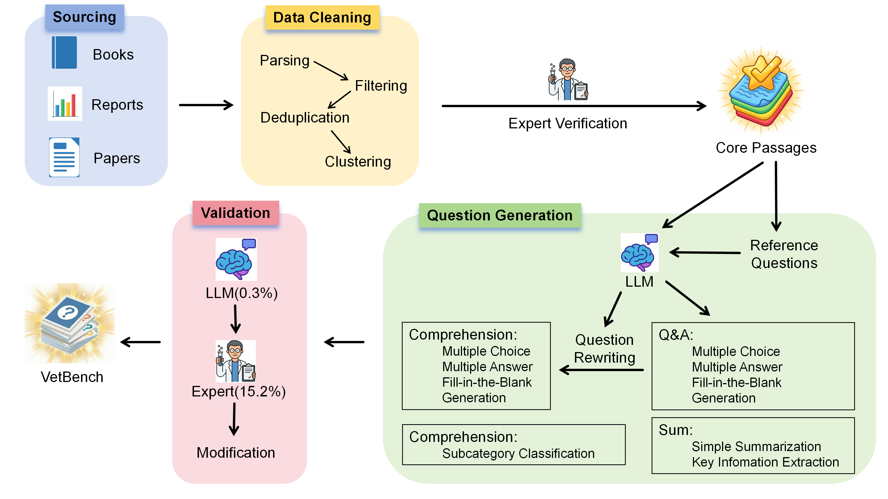

<div align="center">

<h1>VetBench: A Benchmark for Evaluating Large Language Models in Veterinary Medicine</h1>

[](License)
[](LICENSE-APACHE-2.0)
[](LICENSE-MIT)

</div>

## 📖 Introduction

**VetBench** is the first comprehensive, multi-task benchmark designed to evaluate Large Language Models (LLMs) within the **"One Health"** framework of veterinary medicine.

While LLMs show transformative potential in healthcare, their application in veterinary medicine is hindered by a lack of rigorous evaluation standards. VetBench addresses this gap by covering **3 core pillars** (Basic, Preventive, and Clinical Veterinary Medicine) across **10 sub-disciplines**.

### Key Features
* **Full-Spectrum Coverage:** 3,036 high-quality questions derived from 1,932 expert-curated core passages.
* **Hybrid Construction Pipeline:** Combines automated generation with rigorous expert validation (Human-in-the-loop).
* **Multi-Task Evaluation:** Includes 11 distinct task types ranging from basic knowledge retrieval (QA) to complex reasoning (Case Analysis).
* **Rigorous Metrics:** Utilizes a "Meta-Evaluation" validated Judge Model (GPT-5.2) and specific metrics (Accuracy, Macro-F1, BERTScore) for different task paradigms.


## 📂 Repository Structure

This repository contains the dataset, prompt templates, and evaluation scripts used in the VetBench paper.

```text
.
├── text/
│   ├── core_passages.json       # 1,932 High-quality veterinary text segments 
├── problem_bank/                # 3,036 Generated questions across 11 JSONL task files
│   ├── QA1.jsonl
│   ├── QA2.jsonl
│   ├── QA3.jsonl
│   ├── QA4.jsonl
│   ├── SUM1.jsonl
│   ├── SUM2.jsonl
│   ├── RC1.jsonl
│   ├── RC2.jsonl
│   ├── RC3.jsonl
│   ├── RC4.jsonl
│   └── RC5.jsonl
├── few_shot                     # Expert-verified k-shot examples
│   ├── 1_multi_choice.json
│   ├── 2_multi_answer.json
│   ├── ...
│   └── 7_classify.json
├── prompts/                     # Optimized System & User Prompts
│   ├── 1_multi_choice.json
│   ├── 2_multi_answer.json
│   ├── ...
│   └── 7_classify.json
└── README.md
```
## 📊 Dataset & Taxonomy

VetBench is structured into three primary categories and further divided into 10 sub-disciplines:

| Category | Sub-disciplines |
|----------|-----------------|
| Basic Vet Med | Anatomy & Histology, Physiology & Biochemistry, Pathology, Pharmacology |
| Preventive Vet Med | Microbiology & Immunology, Parasitology, Public Health |
| Clinical Vet Med | Internal Medicine, Surgery, Obstetrics & Andrology |

The benchmark includes 11 Task Types designed to probe different cognitive capabilities:

| ID | Task Type | Metric | Count |
|----|-----------|--------|-------|
| QA-1 | Multiple Choice | Accuracy | 276 |
| QA-2 | Multiple Answer | Macro-F1 | 276 |
| QA-3 | Fill-in-the-Blank | LLM Judge (A/B/C) | 276 |
| QA-4 | Open-ended Generation | Rubric-based Score | 276 |
| SUM-1 | Summarization | BERTScore | 276 |
| SUM-2 | Extraction | BERTScore | 276 |
| RC-1 | Multiple Choice | Accuracy | 276 |
| RC-2 | Multiple Answer | Macro-F1 | 276 |
| RC-3 | Fill-in-the-Blank | LLM Judge (A/B/C) | 276 |
| RC-4 | Open-ended Generation | Rubric-based Score | 276 |
| RC-5 | Classification | Accuracy | 276 |


## 🏆 Leaderboard

Below is a simple summary of model performance from our paper:

| Model | Type | Average Score | Cost Efficiency |
|-------|------|---------------|-----------------|
| Claude 4.5 Opus | Proprietary | 87.20 | Low |
| Gemini 3.0 Pro | Proprietary | 86.68 | Medium |
| GLM 4.7 | Open-Source | 85.20 | High |
| DeepSeek-v3.2 | Open-Source | 84.70 | Extreme |

## ⚖️ License

Unless otherwise noted, the dataset and benchmark materials are licensed under the [Creative Commons Attribution 4.0 International License (CC BY 4.0)](License).

Software/code materials are available under the [Apache License 2.0](LICENSE-APACHE-2.0) and the [MIT License](LICENSE-MIT).
